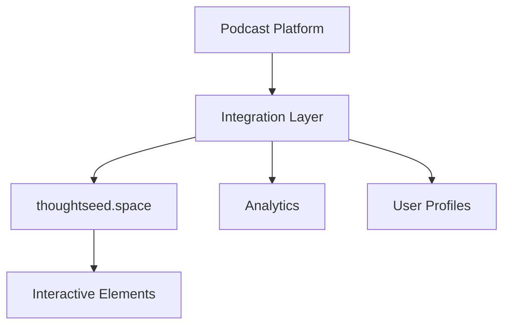

# Thoughtseed.space Integration

## Overview
Integration framework for connecting The Unseen Spectrum podcast experience with the thoughtseed.space website ecosystem.

## Website Components
### Current Features
- Art section exploration
- Information science integration
- Knowledge engineering framework
- Utility design principles
- Behavioral analysis tools

### Integration Points
- Dynamic Terrain Experience
- Podcast Interactive Elements
- User Journey Mapping
- Content Synchronization
- Cross-platform Analytics

## Technical Architecture
### Core Systems
- Content Management
- User Authentication
- Experience Synchronization
- Analytics Integration
- Performance Monitoring

### Data Flow

## User Experience Flow
1. Entry Points
   - Website Navigation
   - Podcast Interface
   - Direct Links
2. Content Discovery
   - Related Materials
   - Interactive Elements
   - Resource Libraries
3. Cross-platform Engagement
   - Seamless Transitions
   - Progress Tracking
   - Personalized Journeys

## Links and References
- Related: [[terrain-deformation]], [[cross-platform-experience]]
- Technical: [[system-architecture]], [[integration-patterns]]
- Experience: [[user-journey]], [[content-strategy]]